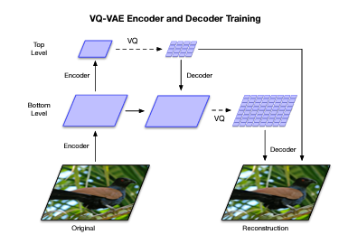
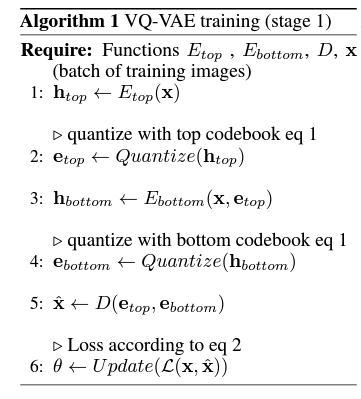
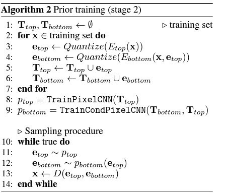

# Generating Diverse High-Fidelity Images with VQ-VAE-2  
***
## 出发点
尝试将VQVAE运用到巨幅模型生成上。

## 思路
* 从有损压缩获得启发，例如：JPEG可以在不明显改变图像观感的基础上删掉80%的数据

## 方法
* 采用VQVAE将图片编码到离散浅空间得到特征向量，这些特征向量的比原图小得多。这些特征的先验可以从encode部分获得。
* 解码离散特征，使得重建的图像与原图像相比有相同的高质量。

## 优点
* 速度快，开销少

## 详细过程
### 训练分层VQVAE

#### 具体：
* 使用多层次矢量量化码（a hierarchy of vector quantized codes）去编码巨幅图像，其实就是不同分辨率子图下进行编码。主要目的是这么做可以对局部信息进行编码。文中指出这么做可以让不同分辨率下的编码模型获得特殊定制化特征。
  * top latent code: global information
  * bottom latent code: local details
* 使用解码器解码图像

### 训练模型拟合先验分布（拟合特征）
从信息论的角度来看，通过使用更接近真实分布的分布重新编码潜在变量，将先验拟合到学习后验的过程可以被认为是潜在空间的无损压缩，从而，导致比特率更接近香农熵。因此，真实熵与学习先验的负对数似然之间的差距越小，人们可以从解码潜在样本中获得越真实的图像样本。（From an information theoretic point of view, the process of fitting a prior to the learned posterior can be considered as lossless compression of the latent space by re-encoding the latent variables with a distribution that is a better approximation of their true distribution, and thus results in bit rates closer to Shannon’s entropy. Therefore the lower the gap between the true entropy and the negative log-likelihood of the learned prior, the more realistic image samples one can expect from decoding the latent samples.）
#### 具体：
* 第二阶段使用强大的自回归神经网络（例如 PixelCNN）建模
* top latent code 象征着全局信息，受益于巨幅感受野文中选用包含多头自注意力层的PixelCNN作为编码器。
* bottom latent code 象征着局部信息，局部信息不需要巨幅感受野，因此可以选用包含深度残差的模块的PixelCNN作为编码器。
* 

## 一些名词：
* autoregressive（自回归）: 下一刻的采样与之前的采样均相关
* like-hood（似然）：给定一组参数用于描述一组数据/估计最有可能产生观测数据的参数值
* negative log like-hood（负对数似然）：用于描述统计模型对一组数据的拟合程度
* inductive biases（归纳偏差）：归纳偏差是指算法中内置的假设和约束，这些假设和约束决定了机器如何从数据中学习。如何设计与管理归纳偏差很重要。
* prior（先验概率分布）：它代表了未引入新数据前对某个事件的知识。先验与似然函数相结合，似然函数表示给定特定参数值时所观察到的数据的概率，从而得到后验分布，后验分布表示在观察到数据后对该参数的更新信念。
* posterior（后验概率分布）：后验分布表示在给定观测数据和先验信念的情况下，关于一个参数或一组参数的更新信念。
* marginal posterior（边际后验概率分布）：边际后验分布是通过对除感兴趣的参数外的所有参数值的联合后验分布进行积分得到的。可以用于更新感兴趣的参数。