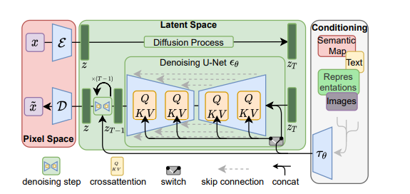

# High-Resolution Image Synthesis with Latent Diffusion Model  
github地址:https://github.com/CompVis/latent-diffusion

***
## 出发点
现有的概率扩散模型需要强大的算力支持，我们需要在保证生成效果完备的前提下减小计算量。

## 思路
机器学习的两个阶段：
* 感知压缩阶段，去除高频细节，学习少量的语义变化
* 语义压缩阶段，生成模型学习数据的语义与概念组成
找到一种方法在感知上能够等效传统扩散模型，从而减小计算空间，从而加快计算量

## 方法
构建了一个由VAE+DDPM的模型
* VAE:进行空间压缩，生成Latent space
* DDPM:在潜在空间中进行扩散
为了加入更多的特性，在扩散过程中引入了Transformer模块，尝试将其他信息引入到扩散过程中，使得text-to-image,image-to-image成为可能。 

## 优点
* 减少了计算所需要的资源
* 在高维度上能获得更好的效果，重建效果更精美
* 不需要对重建和生成能力进行加权
* 可以引入多模态
***

## 详细过程
### 感知图像压缩
感知图像压缩阶段基于[Classifier-free diffusion guidance](https://arxiv.org/abs/2207.12598)构建了一个autoencoder，通过结合[感知损失](https://arxiv.org/abs/1801.03924)以及基于补丁的对抗性目标训练。
这使得重建的图像更具有真实感，同时避免了仅仅依靠像素空间损失导致的图像模糊。

#### 具体：

Encoder: $e$
Decoder: $D$

Input: 
$ x \in R^{H\times W \times 3}$

Latent repersentation: 
$z = e(x), z \in R^{h\times w \times c}$

Output:
$\overline x = D(z) = D(eE(x)) $

构建autoencoder的目的就是要让$\overline x$ 无限接近 $x$，为了更好的对隐空间进行约束，作者选用了两种约束方式：
* 用KL散度约束到正态分布
* VQ方法（参考VQ-GAN，后期补上）

### 潜在扩散模型
与传统的在像素空间中的扩散过程不同，在潜在空间中的扩散过程更适合基于似然方法的生成模型：
* 潜在空间中更关注语义信息，忽略掉了高频信息
* 计算更加高效

与传统自回归（根据$x_1$到$x_{t-1}$来预测$x_t$）的方法（传统DDPM）相比，文中可以选用基于图形的特殊的归纳偏差作为$Z_t$:
$L_{LDM}:=E_{e(x),\epsilon \sim N(0,1),t}\{||\epsilon-e_\theta(Z_t,t)||^2_2\}$
其中$Z_t$来自于编码器$e$

### 调节
通过构建交叉注意力模块尝试将多模态信息引入潜在空间扩散中:
$L_{LDM}:=E_{e(x),\epsilon \sim N(0,1),t}\{||\epsilon-e_\theta(Z_t,t,T_\theta(y))||^2_2\}$
其中$T_\theta(y)$为构建的新模块输入。

## 实验

## 疑问
* 扩散模型在隐空间中已知$x_t$那么该扩散模型的扩散步数是多少？